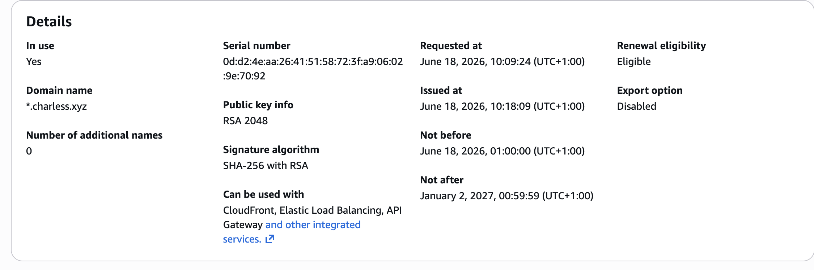
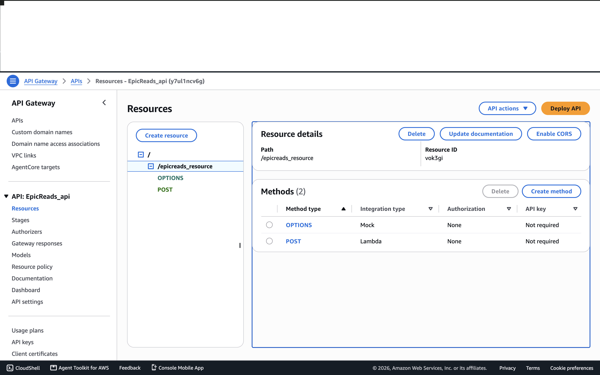

# 🚀 Serverless Lead Capture Platform on AWS

> **Production-style serverless web application** built with Amazon S3,
> CloudFront, Route 53, API Gateway, AWS Lambda and Amazon SES.

## Overview

This project demonstrates how to build a fully serverless lead capture
platform on AWS. Visitors access a static website hosted on Amazon S3
and delivered globally through Amazon CloudFront. When a user submits
the **Get Free Ebook** form, the request is sent to Amazon API Gateway,
processed by AWS Lambda and an email notification is delivered using
Amazon SES. Amazon CloudWatch records execution logs for monitoring and
troubleshooting.

The solution removes the need to manage backend servers while providing
a scalable, secure and cost-effective architecture.

------------------------------------------------------------------------

# 🏗️ Solution Architecture

> Replace with your architecture diagram.


The architecture follows an event-driven design where each AWS service
performs a dedicated responsibility.

------------------------------------------------------------------------

# 🎯 Project Objectives

- Build a fully serverless web application on AWS.
- Host a responsive landing page using Amazon S3.
- Deliver content globally with Amazon CloudFront.
- Expose a REST API through Amazon API Gateway.
- Process contact form submissions with AWS Lambda.
- Persist customer enquiries in Amazon DynamoDB for durable storage and future retrieval.
- Send automated email notifications using Amazon SES.
- Monitor application execution and troubleshoot issues using Amazon CloudWatch.

------------------------------------------------------------------------

# ☁️ AWS Services Used

  Service                   Purpose
  ------------------------- --------------------------
  Amazon S3                 Static website hosting
  Amazon CloudFront         Content delivery network
  Amazon Route 53           Custom domain & DNS
  AWS Certificate Manager   HTTPS certificate
  Amazon API Gateway        REST API
  AWS Lambda                Backend logic
  Amazon SES                Email notifications
  Amazon CloudWatch         Monitoring

------------------------------------------------------------------------

# 🔄 End-to-End Request Flow

``` text
User
 │
 ▼
GoDaddy (DNS)
 │
 ▼
CloudFront
 │
 ▼
Amazon S3
 │
 ▼
Submit Form
 │
 ▼
API Gateway
 │
 ▼
AWS Lambda
 ├──────────────► Amazon DynamoDB
 │                    │
 │                    ▼
 │             Store Contact Record
 │
 └──────────────► Amazon SES
                      │
                      ▼
              Email Notification
                      │
                      ▼
              CloudWatch Logs
```

------------------------------------------------------------------------

# 🔐 Security Considerations

-   HTTPS enabled with AWS Certificate Manager.
-   DNS managed through Amazon Route 53.
-   IAM least-privilege permissions for Lambda.
-   Verified sender identity in Amazon SES.
-   CORS configured in API Gateway.

------------------------------------------------------------------------

# 🚀 Implementation Walkthrough

## Amazon S3

### Overview

Amazon S3 hosts the static frontend of the application, providing a
durable and highly available platform for HTML, CSS, JavaScript and
image assets.

### Implementation

A static website bucket was created and configured as the CloudFront
origin. Frontend updates were uploaded directly to the bucket whenever
application changes were made.

### Screenshot


*Figure 1. Amazon S3 bucket configured to host the static website.*

------------------------------------------------------------------------

## Amazon CloudFront

### Overview

CloudFront improves application performance by serving cached content
from AWS edge locations while providing HTTPS connectivity.

### Implementation

The distribution was configured with the S3 bucket as the origin and
linked to a custom domain secured with AWS Certificate Manager.

### Screenshot


*Figure 2. CloudFront distribution delivering the website over HTTPS.*

------------------------------------------------------------------------

## Domain & DNS Management (GoDaddy)

### Overview

The application uses a custom domain purchased through GoDaddy. Rather than managing DNS with Amazon Route 53, the domain's DNS records were configured within GoDaddy to point traffic to the Amazon CloudFront distribution.

### Implementation

The custom domain (ebook.charless.xyz) was configured in GoDaddy by creating the required DNS records that route user requests to the CloudFront distribution. Once DNS propagation completed, the website became accessible through the custom domain over HTTPS.

### Screenshot


*Figure 3. Route 53 DNS configuration.*

------------------------------------------------------------------------

## AWS Certificate Manager

### Overview

AWS Certificate Manager provides the SSL/TLS certificate used to secure
the website.

### Implementation

A public certificate was requested, validated and attached to the
CloudFront distribution.

### Screenshot



*Figure 4. SSL certificate issued through AWS Certificate Manager.*

------------------------------------------------------------------------

## Amazon API Gateway

### Overview

API Gateway receives contact form submissions and securely invokes AWS
Lambda.

### Implementation

A REST API with a POST endpoint was created. Lambda Proxy Integration
and CORS were configured to allow requests from the frontend.

### Screenshot



*Figure 5. REST API integrated with AWS Lambda.*

------------------------------------------------------------------------

## AWS Lambda

### Overview

Lambda contains the backend business logic responsible for processing
customer enquiries.

### Implementation

The function receives the request from API Gateway, extracts the
submitted details and sends an email using Amazon SES before returning a
successful response.

### Screenshot


*Figure 6. Lambda function processing contact form requests.*

------------------------------------------------------------------------

## Amazon SES

### Overview

Amazon SES delivers transactional email notifications generated by the
Lambda function.

### Implementation

A verified sender identity was configured and the Lambda execution role
was granted permission to send emails.

### Screenshot


*Figure 7. Verified Amazon SES identity.*

------------------------------------------------------------------------

## Successful Form Submission

The confirmation message validates that the frontend, API Gateway,
Lambda and SES are successfully integrated.


*Figure 8. Successful end-to-end request.*

------------------------------------------------------------------------

## Email Notification

The received email confirms that the submitted enquiry was successfully
processed by Lambda and delivered by Amazon SES.


*Figure 9. Email notification received.*

------------------------------------------------------------------------

## Amazon CloudWatch

CloudWatch logs were used throughout development to monitor Lambda
execution and troubleshoot runtime issues.


*Figure 10. Successful Lambda execution recorded in CloudWatch.*

------------------------------------------------------------------------

# ⚠️ Challenges Encountered & Resolution

### CORS Errors

Browser requests were initially blocked because API Gateway was not
configured for cross-origin requests.

**Resolution:** Enabled CORS on the API resource, updated Lambda
response headers and redeployed the API.

### API Endpoint Mismatch

The frontend was still calling the previous endpoint instead of the
deployed API Gateway URL.

**Resolution:** Updated the JavaScript application to use the correct
Invoke URL and resource path.

### Lambda Event Parsing

The Lambda function initially expected a different request structure.

**Resolution:** Enabled Lambda Proxy Integration and updated the
function to process the incoming event correctly.

### CloudFront Cache

Frontend updates were not immediately visible.

**Resolution:** Uploaded the latest files to S3 and refreshed CloudFront
content.

------------------------------------------------------------------------

# 💡 Lessons Learned

This project strengthened my understanding of serverless architecture,
REST API integration, event-driven computing, DNS, HTTPS, IAM
permissions and troubleshooting distributed cloud applications. It also
highlighted the importance of browser debugging tools and CloudWatch
logs when diagnosing integration issues.

------------------------------------------------------------------------

# 🚀 Future Improvements

-   Store submissions in DynamoDB.
-   Deploy infrastructure using Terraform.
-   Add GitHub Actions CI/CD.
-   Implement CAPTCHA protection.
-   Add Amazon SNS notifications.

------------------------------------------------------------------------

# 👨‍💻 Author

**Charles Ekairia**

Cloud & DevOps Engineer
